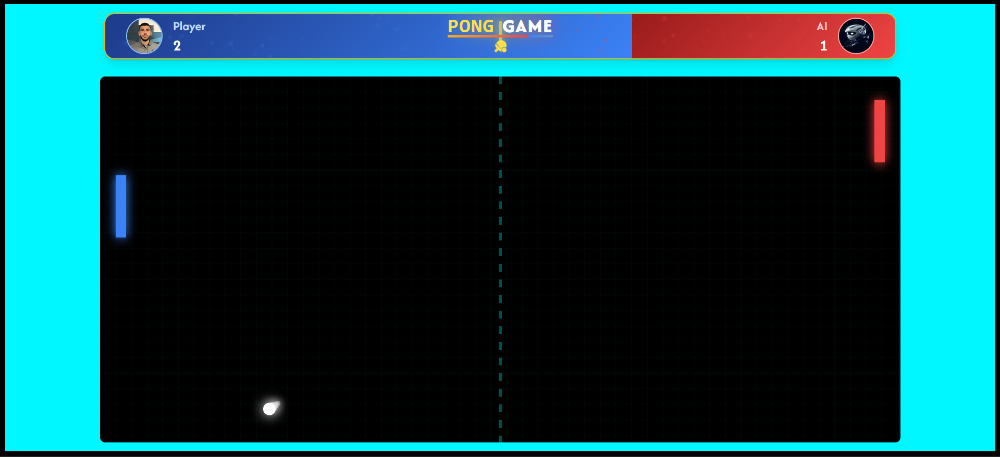
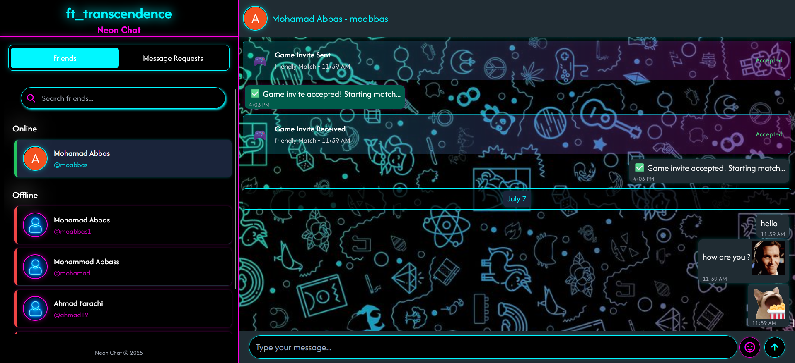
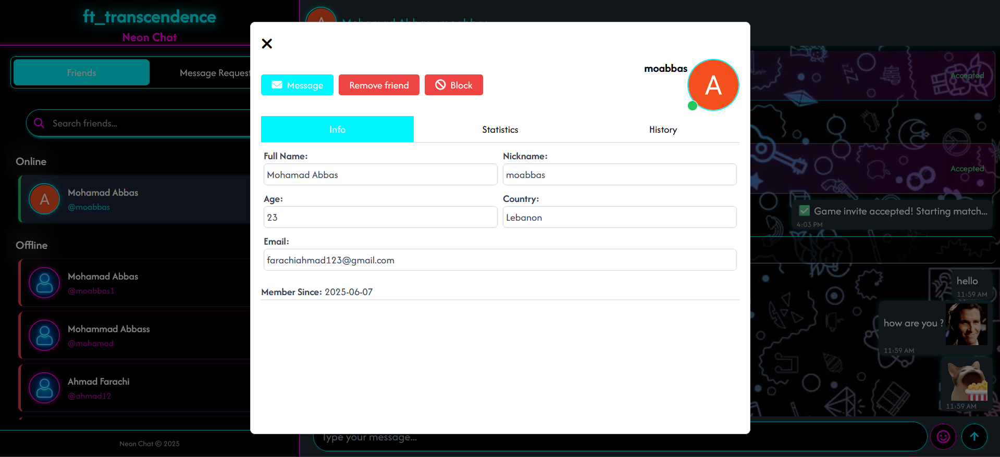
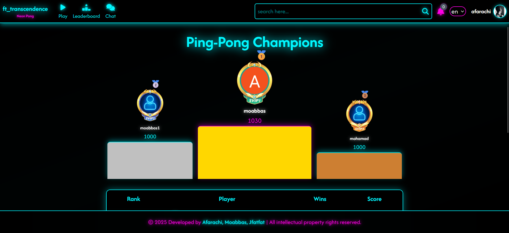

# ft_transcendence

**ft_transcendence** is a full-stack, real-time web application that brings a modern multiplayer twist to the classic Pong game. Designed as a responsive, secure, and feature-rich platform, it allows users to compete, socialize, and track their progress—all within a single-page application (SPA).

---

🚀 Quick Start
Get up and running in minutes:
bash# Clone the repository
git clone https://github.com/moabbas-dev/ft_transcendence.git
cd ft_transcendence

# Start the application
docker compose up --build

# Access the application
open https://localhost:4443

---
## ⚙️ Tech Stack

- **Frontend:** TypeScript, TailwindCSS
- **Backend:** Node.js, Fastify (microservices architecture)
- **Database:** SQLite3
- **Authentication:** JWT, 2FA, Google OAuth
- **Real-time Communication:** WebSocket
- **Deployment:** Docker, NGINX
- **Security:** HTTPS, input validation, XSS/SQLi protection, password hashing

---

## 🎮 Features

- 🔴 **Real-time online Pong** matches with other players  
- 🏆 **Tournament mode** with automatic matchmaking and score tracking  
- 🧠 **ELO-based matchmaking** system  
- 🎮 **Offline 1v1** gameplay on the same machine  
- 👤 **Account system** with:
  - JWT-based registration/login
  - Google OAuth login
  - 2FA (Two-Factor Authentication)  
- 🖼️ Custom avatars & editable player profiles
- 🔤 Multiple languages support  
- 🧑‍🤝‍🧑 Friend system with online presence tracking  
- 💬 **Live chat** (friends & non-friends)  
- 📈 Personal match history and performance statistics  
- 🏅 Global leaderboard  
- 🛡️ Security:
  - JWT session handling
  - Hashed passwords
  - Form validation
  - XSS & SQL injection protection  
- 🐳 **Dockerized infrastructure** for easy setup and deployment (`docker compose up`)  

---

## 📸 Screenshots

### 🏠 Home Page

### 🕹️ Game Screen

### 🧑‍🤝‍🧑 Friends & Chat

### 📊 Player Profile & Stats

### 🏆 leaderboard

---

## 📝 License

This project is part of the 42 core curriculum and is for educational purposes only.
